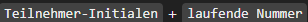

# Business File Manager (BFM)

**Anmeldedaten für gemeinsames BFM-Konto**

1. Zu dieser Seite gehen : [BFM](https://my.business-filemanager.de/Login.zul)
2. Anmeldedaten : 

- E-mail-Adresse : tractusxdays@gmail.com
- Passwort : 3y)"59xvE16bhyJ]DfGl

### **Screenshot-ID und Identifizierbarkeit:** 
 1. Vergabe einer Screenshot-ID
   - Die ID soll so aussehen :
 
       - 
 
 
 - Beispiel: JD-001 für den ersten Screenshot von John Doe.
  
  2. Dateibenennung 
  - Bennen Sie ihre Sccreenshots nach der ID
    - Beispiel: JD-001.png
  
3.  Metadaten mit Screenshot speichern:
   - Machen Sie eine kurze Beschreibung mit ihrem Namen, Team, und Screenshot-ID in einer separaten Datei oder als Kommentar einfügen.
