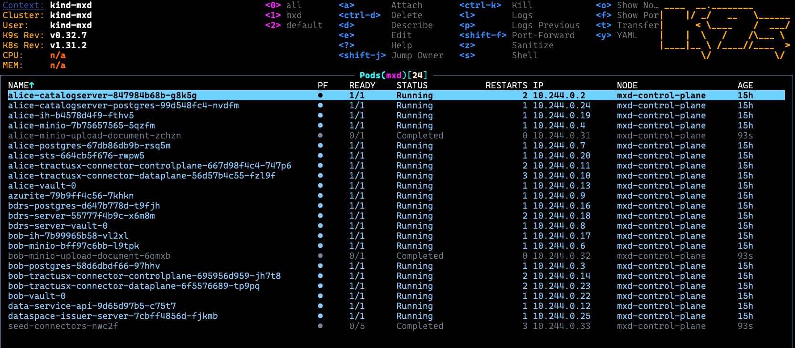
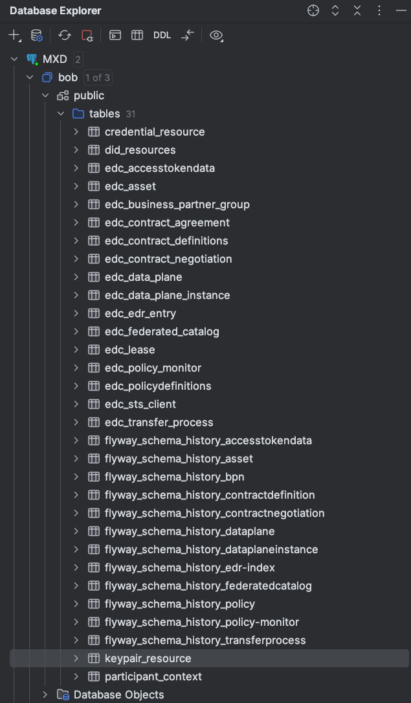

# Minimum Tractus-X Dataspace

## 1. Prerequisites

In order to run the Minimum Tractus-X Dataspace "MXD" on your local machine, please make sure the following
preconditions are met.

- Have a local Kubernetes runtime ready. We've tested this setup with [KinD](https://kind.sigs.k8s.io/), but other
  runtimes such
  as [Minikube](https://minikube.sigs.k8s.io/docs/start/) may work as well, we just haven't tested them. All following
  instructions will assume KinD.
- Install [Terraform](https://developer.hashicorp.com/terraform/tutorials/aws-get-started/install-cli).
- a POSIX-compliant shell, e.g. `bash` or `zsh` unless stated otherwise
- basic knowledge about Helm and Kubernetes
- [Optional] a cli tool to easily print logs of a K8S deployment, such as [`stern`](https://github.com/stern/stern)
- [Optional] a graphical tool to inspect your Kubernetes environment, such as [Lens](https://k8slens.dev/).
  Not mandatory of course, but all screenshots in this doc are created off of Lens.
- [Optional] a graphical tool to inspect Postgres databases, such as [PgAdmin](https://www.pgadmin.org/). Screenshots in
  this guide are created off of PgAdmin.
- [Optional] a graphical tool to send REST requests, such as [Postman](https://www.postman.com/). This sample will
  include Postman collections that can be imported.

## 2. Basic dataspace setup

The "MXD" dataspace initially consists of several components: `Alice` and `Bob` (two Tractus-X EDC connectors),
a `vault` instance each, a Postgres database, a Managed Identity Wallet app, a Keycloak instance. `Alice` and `Bob` will
be our dataspace participants. Each of them stores their secrets in their "private" vault instance, and there is a
shared Postgres server, where each of them has a database. MIW and Keycloak are "central" components, they only exist
once and are accessible by all participants.

For the most bare-bones installation of the dataspace, execute the following commands in a shell:

```shell
kind create cluster -n mxd --config kind.config.yaml
# the next step is specific to KinD and will be different for other Kubernetes runtimes!
kubectl apply -f https://raw.githubusercontent.com/kubernetes/ingress-nginx/main/deploy/static/provider/kind/deploy.yaml
# wait until the ingress controller is ready
kubectl wait --namespace ingress-nginx \
  --for=condition=ready pod \
  --selector=app.kubernetes.io/component=controller \
  --timeout=90s
cd <path/of/mxd>
terraform init
terraform apply
# type "yes" and press enter when prompted to do so 
```

Notice that the `kubectl apply` command deploys a Kubernetes Ingress Controller to the cluster and is required to reach
our applications from outside the cluster. Specifically, it deploys an NGINX ingress controller. Notice also, that the
command is *specific to KinD* and will likely not work on other Kubernetes runtimes (minikube, ...) or with other
ingress controllers!

Wait. Then wait some more. It will take a couple of minutes until all services are booted up. If your machine is a
potato, it'll take even longer. Just get a coffee. Eventually, it should look similar to this:



### Inspect terraform output

After the `terraform` command has successfully completed, it will output a few configuration and setup values
that we will need in later steps. Please note that most values will be different on your local system.

```shell
Outputs:

alice-urls = {
  "health" = "http://localhost/alice/health"
  "management" = "http://localhost/alice/management/v2"
}
bob-node-ip = "10.96.248.22"
bob-urls = {
  "health" = "http://localhost/bob/health"
  "management" = "http://localhost/bob/management/v2"
}
connector1-aeskey = "R3BDWGF4SWFYZigmVj0oIQ=="
connector1-client-secret = "W3s1OikqRkxCbltfNDBmRg=="
connector2-aeskey = "JHJISjZAS0tSKlNYajJTZA=="
connector2-client-secret = "enFFUlkwQyZiJSRLQSohYg=="
keycloak-database-credentials = {
  "database" = "miw"
  "password" = "Tn*iwPEuCgO@d==R"
  "user" = "miw_user"
}
keycloak-ip = "10.96.103.80"
miw-database-pwd = {
  "database" = "keycloak"
  "password" = "W:z)*mnHdy(DTV?+"
  "user" = "keycloak_user"
}
postgres-url = "jdbc:postgresql://10.96.195.240:5432/"
```

### Inspect the databases

Please be aware, that all services and applications that were deployed in the previous step, are **not** accessible from
outside the Kubernetes cluster. That means, for example, the Postgres database cannot be reached out-of-the-box.

Naturally there are several ways to enable access to those services (Load balancers, Ingresses, etc.) but for the sake
of simplicity we will use a plain Kubernetes port-forwarding:

```shell
kubectl port-forward postgres-5b788f6bdd-bvt9b 5432:5423
``` 

> Note that the actual pod name will be slightly different in your local cluster.

Then, using PgAdmin, connect to the Postgres server at `jdbc:postgresql://localhost:5432/` using `user=postgres`
and `password=postgres`:



Every service in the cluster has their own database, but for the sake of simplicity, they are hosted in one Postgres
server. We will show in [later sections](#8-improving-the-setup), how the databases can be segregated out. Feel free to
inspect all the databases and tables, but there is not much data in there yet. There is just a few automatically seeded
assets, policies and contract definitions.

> Please be aware that among the list of databases, there is one named "trudy" which is designated for a new participant named Trudy. You can refer [here](#7-add-new-participant-trudy) for additional information about adding this new participant.

### Verify your local installation

In order to check that the connectors were deployed successfully, please execute the following commands in a shell:

```shell
curl -X GET http://localhost/bob/health/api/check/liveness
curl -X GET http://localhost/alice/health/api/check/liveness
```

which should return something similar to this, the important part being the `isSystemHealthy: true` bit:

```json
{
  "componentResults": [
    {
      "failure": null,
      "component": "Observability API",
      "isHealthy": true
    },
    {
      "failure": null,
      "component": null,
      "isHealthy": true
    }
  ],
  "isSystemHealthy": true
}
```

Once we've established the basic readiness of our connectors, we can move on to inspect a few data items:

```shell
curl -X POST http://localhost/bob/management/v3/assets/request -H "x-api-key: password" -H "content-type: application/json" | jq
```

this queries the `/assets` endpoint returning the entire list of assets that `bob` currently maintains. You should see
something like

```json
[
  {
    "@id": "1",
    "@type": "edc:Asset",
    "edc:properties": {
      "edc:description": "Product EDC Demo Asset 1",
      "edc:id": "1"
    },
    "edc:dataAddress": {
      "@type": "edc:DataAddress",
      "edc:type": "HttpData",
      "edc:baseUrl": "https://jsonplaceholder.typicode.com/todos"
    },
    "@context": {
      "dct": "https://purl.org/dc/terms/",
      "tx": "https://w3id.org/tractusx/v0.0.1/ns/",
      "edc": "https://w3id.org/edc/v0.0.1/ns/",
      "dcat": "https://www.w3.org/ns/dcat/",
      "odrl": "http://www.w3.org/ns/odrl/2/",
      "dspace": "https://w3id.org/dspace/v0.8/"
    }
  },
  {
    "@id": "2",
    "@type": "edc:Asset",
    "edc:properties": {
      "edc:description": "Product EDC Demo Asset 2",
      "edc:id": "2"
    },
    "edc:dataAddress": {
      "@type": "edc:DataAddress",
      "edc:type": "HttpData",
      "edc:baseUrl": "https://jsonplaceholder.typicode.com/todos"
    },
    "@context": {
      "dct": "https://purl.org/dc/terms/",
      "tx": "https://w3id.org/tractusx/v0.0.1/ns/",
      "edc": "https://w3id.org/edc/v0.0.1/ns/",
      "dcat": "https://www.w3.org/ns/dcat/",
      "odrl": "http://www.w3.org/ns/odrl/2/",
      "dspace": "https://w3id.org/dspace/v0.8/"
    }
  }
]
```

Note: the same thing can be done to inspect policies and contract definitions. The respective `curl` commands are:

```shell
# policies:
curl -X POST http://localhost/bob/management/v2/policydefinitions/request -H "x-api-key: password" -H "content-type: application/json" | jq
# contract defs:
curl -X POST http://localhost/bob/management/v2/contractdefinitions/request -H "x-api-key: password" -H "content-type: application/json" | jq
```

Alternatively, please check out the [Postman collections here](./postman)

## 3. Add some data

In this step we will focus on inserting data into our participant Alice using
the [Management API](https://app.swaggerhub.com/apis/eclipse-edc-bot/management-api/0.1.4-SNAPSHOT). We will use plain
CLI tools (`curl`) for this, but feel free to use graphical tools such as Postman or Insomnia.

### 3.1 Add a basic `asset`, `policy` and `contract-definition`

Now we will add an asset titled "simple-asset", an access policy, a contract policy, and then we'll combine them in a
contract definition. We'll do this only for Alice, but feel free to try this out with Bob as well.
There will not be any restrictions on that asset, meaning, every dataspace member will be able to "see" it.

> TODO: add link to policy generator tool

> TODO: curl commands

### 3.2 Add a restricted `asset`

We will add another asset, but this time we'll put a restriction on it: only participants that have the `Dismantler`
credential will be able to see it. Technically, that means, that the access policy contains a restriction.

> TODO: add link to policy generator tool

> TODO: curl commands

### 3.3 [Optional] Add Kubernetes deployment for a `newman` container

Now that we've done the work manually, we'll learn an easy and convenient way to automatically seed data directly after
the cluster starts up and the connector apps are deployed. For that, we'll use a command line tool called `newman` and
run it in a pod, which executes a Postman collection and tests for the HTTP results.

## 4. Bob gets Alice's catalog

Bob wants to get Alice's data catalog. Since Bob does not have the `Dismantler` credential, he will only be able to see
the "simple-asset" from [step 3.1](#31-add-a-basic-asset-policy-and-contract-definition).

We can fetch Alice's catalog with this `curl` command:

```shell
curl --location 'http://localhost/bob/management/v2/catalog/request' --header 'Content-Type: application/json' --header 'X-Api-Key: password' \
--data-raw '{
    "@context": {
        "edc": "https://w3id.org/edc/v0.0.1/ns/"
    },
    "@type": "CatalogRequest",
    "counterPartyAddress":"http://alice-controlplane:8084/api/v1/dsp",
    "protocol": "dataspace-protocol-http",
    "querySpec": {
        "offset": 0,
        "limit": 50
    }
}' | jq
```

this requests the catalog from Alice using the `dsp` protocol with address `http://alice-controlplane:8084/api/v1/dsp`.
The additional field `querySpec` is used to filter, limit and sort the elements in the catalog.

More information about the catalog [here](https://eclipse-edc.github.io/docs/#/documentation/developer/handbook?id=catalog).

The catalog response will look like this:

```json
{
    "@id": "736199e5-5b9e-4944-8568-46af97bde862",
    "@type": "dcat:Catalog",
    "dcat:dataset": [
        {
            "@id": "1",
            "@type": "dcat:Dataset",
            "odrl:hasPolicy": {
                "@id": "MQ==:MQ==:MDJlMGRlOWUtNzdhZS00N2FhLTg5ODktYzEyMTdhMDE4ZjJh",
                "@type": "odrl:Set",
                "odrl:permission": {
                    "odrl:target": "1",
                    "odrl:action": {
                        "odrl:type": "USE"
                    },
                    "odrl:constraint": {
                        "odrl:or": {
                            "odrl:leftOperand": "BusinessPartnerNumber",
                            "odrl:operator": {
                                "@id": "odrl:eq"
                            },
                            "odrl:rightOperand": "BPNL000000000002"
                        }
                    }
                },
                "odrl:prohibition": [],
                "odrl:obligation": [],
                "odrl:target": "1"
            },
            "dcat:distribution": [
                {
                    "@type": "dcat:Distribution",
                    "dct:format": {
                        "@id": "HttpProxy"
                    },
                    "dcat:accessService": "6a7e8d1e-e8f2-49f0-bf4d-a9b862c73889"
                },
                {
                    "@type": "dcat:Distribution",
                    "dct:format": {
                        "@id": "AmazonS3"
                    },
                    "dcat:accessService": "6a7e8d1e-e8f2-49f0-bf4d-a9b862c73889"
                }
            ],
            "edc:description": "Product EDC Demo Asset 1",
            "edc:id": "1"
        }
    ],
    "dcat:service": {
        "@id": "6a7e8d1e-e8f2-49f0-bf4d-a9b862c73889",
        "@type": "dcat:DataService",
        "dct:terms": "connector",
        "dct:endpointUrl": "http://alice-controlplane:8084/api/v1/dsp"
    },
    "edc:participantId": "BPNL000000000001",
    "@context": {
        "dct": "https://purl.org/dc/terms/",
        "tx": "https://w3id.org/tractusx/v0.0.1/ns/",
        "edc": "https://w3id.org/edc/v0.0.1/ns/",
        "dcat": "https://www.w3.org/ns/dcat/",
        "odrl": "http://www.w3.org/ns/odrl/2/",
        "dspace": "https://w3id.org/dspace/v0.8/"
    }
}
```

In this case the provider, with participant id `BPNL000000000001`, is offering some data with id `1`, description
`Product EDC Demo Asset 1`, throught the offer `MQ==:MQ==:MDJlMGRlOWUtNzdhZS00N2FhLTg5ODktYzEyMTdhMDE4ZjJh` and the `BusinessPartnerNumber` policy
restriction. Those informations will be used for negotiating a contract with the provider.

## 5. Bob transfers data from Alice

Now that Bob knows what Alice is offering, he wants to transmit data. Before Bob can actually request data, he needs to
negotiate a contract with Alice. We'll do this using the management API:

> TODO: curl commands, example response, show how IDs correlate

Once Bob and Alice have reached an agreement, Bob can start requesting data from Alice. Keeping in mind that he is only
permitted to see the "simple-asset", so that's what he'll request. The "simple-asset" is actually a REST API that is
hosted in Alice's private network realm. Alice will proxy the access to this API. We call this a "
consumer-pull-transfer"
and it is the most basic transfer available.

> TODO: curl commands, show data response

## 6. Simplify negotiation and transfer using the EDR API

In [step 5](#5-bob-transfers-data-from-alice) we saw how a contract negotiation and a transfer can be executed using the
management API, first the negotiation and then the transfer phase, but there is a simpler way to do this: enter the EDR
API.
Using this convenient tool, we don't have to care about the intricacies of negotiation and transfer anymore, we can
simply request an API token to Alice's proxy, and start sucking data out of it.
We don't even need to worry about token expiry - the EDR API has a little gizmo that automatically refreshes the token
if it nears expiry. 

A detailed documentation about the EDR API is available [here](https://github.com/eclipse-tractusx/tractusx-edc/blob/main/docs/samples/edr-api-overview/edr-api-overview.md).

The EDR API is a tiny wrapper on top of the contract negotiation and transfer state machines. With a single request the system will track the EDR negotiation
for us, and it will store it locally for future usage. The API for starting a new EDR negotiation is similar to the contract negotiation one.

We can start a new EDR negotiation with this `curl` command:

```shell
curl --location 'http://localhost/bob/management/edrs' \
--header 'Content-Type: application/json' \
--header 'X-Api-Key: password' \
--data-raw '{
	"@context": {
		"odrl": "http://www.w3.org/ns/odrl/2/"
	},
	"@type": "NegotiationInitiateRequestDto",
	"connectorAddress": "http://alice-controlplane:8084/api/v1/dsp",
	"protocol": "dataspace-protocol-http",
	"connectorId": "BPNL000000000001",
	"providerId": "BPNL000000000001",
	"offer": {
		"offerId": "MQ==:MQ==:MDJlMGRlOWUtNzdhZS00N2FhLTg5ODktYzEyMTdhMDE4ZjJh",
		"assetId": "1",
		"policy": {
			"@type": "odrl:Set",
			"odrl:permission": {
				"odrl:target": "1",
				"odrl:action": {
					"odrl:type": "USE"
				},
				"odrl:constraint": {
					"odrl:or": {
						"odrl:leftOperand": "BusinessPartnerNumber",
						"odrl:operator": { "@id": "odrl:eq" },
						"odrl:rightOperand": "BPNL000000000002"
					}
				}
			},
			"odrl:prohibition": [],
			"odrl:obligation": [],
			"odrl:target": "1"
		}
	}
}' | jq
```

For requesting an EDR we have to specify:

- `connectorId` and `providerId`: the participantId returned from the catalog request
- `connectorAddress`: in `dcat:service` field returned from the catalog request 
- `offer`: it's derived by the chosen `dcat:Dataset` returned from the catalog request

If everithing is ok, we'll get this as response:

```json
{
  "@type": "edc:IdResponse",
  "@id": "2f911118-657d-4001-b36c-73cb45222a4a",
  "edc:createdAt": 1694446314832,
  "@context": {
    "dct": "https://purl.org/dc/terms/",
    "tx": "https://w3id.org/tractusx/v0.0.1/ns/",
    "edc": "https://w3id.org/edc/v0.0.1/ns/",
    "dcat": "https://www.w3.org/ns/dcat/",
    "odrl": "http://www.w3.org/ns/odrl/2/",
    "dspace": "https://w3id.org/dspace/v0.8/"
  }
}
```

The `@id` here is the id of the contract negotiation that has been started.

Since the EDR negotiation sits on top of two state machines, contract negotiation and transfer process, it's an asyncronous process itself.
In order to be notified without polling, we could configure the EDC callbacks for being notified on state transition. 

We could for example add this in the original request:

```json
{
  ...
  "callbackAddresses": [
    {
      "uri": "http://localhost:8080/hooks",
      "events": [
        "transfer.process.started"
      ],
      "transactional": false
    }
  ]
}
```

and be notified when the transfer process transition to the state `STARTED` (EDR negotiatied).

For having a list of the negotiatied EDR for the `assedId` `1` we can use this `curl` command:

```shell
curl --location 'http://localhost/bob/management/edrs?assetId=1' --header 'X-Api-Key: password' | jq
```

and the response should look like this:

```json
[
  {
    "@type": "tx:EndpointDataReferenceEntry",
    "edc:agreementId": "MQ==:MQ==:MWI5OTg2N2YtNTc0ZS00MzUwLTk2NmMtNDFiODE2MzllZTVi",
    "edc:transferProcessId": "89f0d94e-670e-4b0a-a8d9-a6adc726c005",
    "edc:assetId": "1",
    "edc:providerId": "BPNL000000000001",
    "tx:edrState": "NEGOTIATED",
    "tx:expirationDate": 1694447767000,
    "@context": {
      "dct": "https://purl.org/dc/terms/",
      "tx": "https://w3id.org/tractusx/v0.0.1/ns/",
      "edc": "https://w3id.org/edc/v0.0.1/ns/",
      "dcat": "https://www.w3.org/ns/dcat/",
      "odrl": "http://www.w3.org/ns/odrl/2/",
      "dspace": "https://w3id.org/dspace/v0.8/"
    }
  }
]
```

To be able to fetch the data with only the `assetId` via consumer data plane proxy (see more later), only one
`EndPointDataReferenceEntry` associated with an `assetId` should be valid (`Negotiated` or `Refreshing`) at one point in time.
This will allow the proxy to fetch the right `EDR` while requesting data with the `assetId`. Alternatively if we negotiated multiple
`EDRs` for the same `assetId` for some reason, we should use the `transferprocessId` for transferring the data.

The renewal of the token is automatically handled by the `EDR` extension, we just need to fire the first EDR negotiation
and start fetching the data.

Since the EDR is renewed automatically, it can happen that while fetching the EDRs for a particular `assetId` we can see multiple entries like this:

```json
[
  {
    "@type": "tx:EndpointDataReferenceEntry",
    "edc:agreementId": "MQ==:MQ==:MWI5OTg2N2YtNTc0ZS00MzUwLTk2NmMtNDFiODE2MzllZTVi",
    "edc:transferProcessId": "ff468685-0f9b-49a1-8ec6-ea40d5a2dc88",
    "edc:assetId": "1",
    "edc:providerId": "BPNL000000000001",
    "tx:edrState": "NEGOTIATED",
    "tx:expirationDate": 1694448312000,
    "@context": {
      "dct": "https://purl.org/dc/terms/",
      "tx": "https://w3id.org/tractusx/v0.0.1/ns/",
      "edc": "https://w3id.org/edc/v0.0.1/ns/",
      "dcat": "https://www.w3.org/ns/dcat/",
      "odrl": "http://www.w3.org/ns/odrl/2/",
      "dspace": "https://w3id.org/dspace/v0.8/"
    }
  },
  {
    "@type": "tx:EndpointDataReferenceEntry",
    "edc:agreementId": "MQ==:MQ==:MWI5OTg2N2YtNTc0ZS00MzUwLTk2NmMtNDFiODE2MzllZTVi",
    "edc:transferProcessId": "89f0d94e-670e-4b0a-a8d9-a6adc726c005",
    "edc:assetId": "1",
    "edc:providerId": "BPNL000000000001",
    "tx:edrState": "EXPIRED",
    "tx:expirationDate": 1694447767000,
    "@context": {
      "dct": "https://purl.org/dc/terms/",
      "tx": "https://w3id.org/tractusx/v0.0.1/ns/",
      "edc": "https://w3id.org/edc/v0.0.1/ns/",
      "dcat": "https://www.w3.org/ns/dcat/",
      "odrl": "http://www.w3.org/ns/odrl/2/",
      "dspace": "https://w3id.org/dspace/v0.8/"
    }
  }
]
```

which means that the second `EDR` is now expired and marked for removal later in time.

The EDR itself is stored in the configured vault. To retrieve it we can use this `curl` command:

```shell
curl --location 'http://localhost/bob/management/edrs/ff468685-0f9b-49a1-8ec6-ea40d5a2dc88' --header 'X-Api-Key: password' | jq
```

where `ff468685-0f9b-49a1-8ec6-ea40d5a2dc88` is the transfer process id of negotiated EDR. Each EDR is bound to one and only transfer process,
and the automatic EDR renewal process will just fire another transfer request with the same configuration when it's near expiry.

The response will look like this:

```json
{
  "@type": "edc:DataAddress",
  "edc:type": "EDR",
  "edc:authCode": "eyJhbGciOiJFUzI1NiJ9.eyJleHAiOjE2OTQ1MjIwNTksImRhZCI6ImNoTTlvVTVLNXQzbDlWMFRsL1ZZdDlLU1J4YmNOSUdzM1FtazNlNktWOWpWcTBkeUhjUDU2Mm82Qk0zSitxeTRwRVg2d0EvWUFsdW9EdGptYnYxZlJoN3VmVmsvQjNONzhBMUhyZ01ENnk2enFsK1BEYzBXa00yTm9ycUJWQUl0TWpVNEFNbGhFMXE1Ym9EQ1lWcVRsQVZnbm9uTlB5MmlVUzVSVTJHTkZtOWFkZVZYR1ZLaDFDWEMzVDV0RkRCS21EMjExWVZYdDExRUlXbCtIU3VISm1PL0xwUUdibFkvaGFicXZ6aUZ0YlppbGlKSDNLdGVhZTZQRkdQTjNWT1Z4YlFrZTNmODNRN3VNeStBNzV4YS9VR1BMcjJlQkJzb0ZVbTBYeFFJS2dBOUROdGxXcnBuR3hwdG9tL1VWY00wQ1RwcWM5eFRRdGlnK3JMVlJ4dUhrb2RreG5KUXhiSENVMnNObnFhdXZJcDV4L04rbGdJN0F1amhtQWxiN2NwUWs0RDhSWWtZSnkvVUZGdGZmZUJLU2k2MnZDeC9QSFJsSERlUGM4VldDaEJTNFF1Q1FXY1pOK2oyUjR5b2Q2a3JlN2JtUStFK3pLUmYva3JhQkJkR041TDR5ZVdIYU0wS3oraGxiSVR5WHg2bjdrQ0VkVVVSREtCUHY3SHdzbHhLTzlxN05ReHplMHFDM0phR2pyWVdHZmJHTzB4SDlJRndsSWpqclZHMzE0WUVxNGdSTjNNPSIsImNpZCI6Ik1RPT06TVE9PTpOV0ZqTTJJeVkyWXRNRGt4WkMwME9UQmxMV0poTXpNdE1ERmxNRGhtTUdNNU5tVTIifQ.2UT3_mIjchrC242TqlLFWoyYPiCOPLLivaN5Xd4_MxhcQkxRkOxrK0IXkXVuRVjC1ReGPi3iaco9LDUxvF3FPw",
  "edc:endpoint": "http://alice-tractusx-connector-dataplane:8081/api/public",
  "edc:id": "ff468685-0f9b-49a1-8ec6-ea40d5a2dc88",
  "edc:authKey": "Authorization",
  "@context": {
    "dct": "https://purl.org/dc/terms/",
    "tx": "https://w3id.org/tractusx/v0.0.1/ns/",
    "edc": "https://w3id.org/edc/v0.0.1/ns/",
    "dcat": "https://www.w3.org/ns/dcat/",
    "odrl": "http://www.w3.org/ns/odrl/2/",
    "dspace": "https://w3id.org/dspace/v0.8/"
  }
}
```

### Fetching data

For fetching the data we can use two strategies depending on the use case:

- Provider data-plane
- Consumer data-plane (proxy)

#### Provider data-plane

Once the right EDR has been identified using the EDR management API, we can use the `endpont`, `authCode` and `authKey` to make the data request:

```shell
curl --location 'http://localhost/alice/api/public' \
--header 'Authorization: eyJhbGciOiJFUzI1NiJ9.eyJleHAiOjE2OTQ1MjIwNTksImRhZCI6ImNoTTlvVTVLNXQzbDlWMFRsL1ZZdDlLU1J4YmNOSUdzM1FtazNlNktWOWpWcTBkeUhjUDU2Mm82Qk0zSitxeTRwRVg2d0EvWUFsdW9EdGptYnYxZlJoN3VmVmsvQjNONzhBMUhyZ01ENnk2enFsK1BEYzBXa00yTm9ycUJWQUl0TWpVNEFNbGhFMXE1Ym9EQ1lWcVRsQVZnbm9uTlB5MmlVUzVSVTJHTkZtOWFkZVZYR1ZLaDFDWEMzVDV0RkRCS21EMjExWVZYdDExRUlXbCtIU3VISm1PL0xwUUdibFkvaGFicXZ6aUZ0YlppbGlKSDNLdGVhZTZQRkdQTjNWT1Z4YlFrZTNmODNRN3VNeStBNzV4YS9VR1BMcjJlQkJzb0ZVbTBYeFFJS2dBOUROdGxXcnBuR3hwdG9tL1VWY00wQ1RwcWM5eFRRdGlnK3JMVlJ4dUhrb2RreG5KUXhiSENVMnNObnFhdXZJcDV4L04rbGdJN0F1amhtQWxiN2NwUWs0RDhSWWtZSnkvVUZGdGZmZUJLU2k2MnZDeC9QSFJsSERlUGM4VldDaEJTNFF1Q1FXY1pOK2oyUjR5b2Q2a3JlN2JtUStFK3pLUmYva3JhQkJkR041TDR5ZVdIYU0wS3oraGxiSVR5WHg2bjdrQ0VkVVVSREtCUHY3SHdzbHhLTzlxN05ReHplMHFDM0phR2pyWVdHZmJHTzB4SDlJRndsSWpqclZHMzE0WUVxNGdSTjNNPSIsImNpZCI6Ik1RPT06TVE9PTpOV0ZqTTJJeVkyWXRNRGt4WkMwME9UQmxMV0poTXpNdE1ERmxNRGhtTUdNNU5tVTIifQ.2UT3_mIjchrC242TqlLFWoyYPiCOPLLivaN5Xd4_MxhcQkxRkOxrK0IXkXVuRVjC1ReGPi3iaco9LDUxvF3FPw' | jq
```

and the response will look like this:

```json
[
    {
        "userId": 1,
        "id": 1,
        "title": "delectus aut autem",
        "completed": false
    },
    {
        "userId": 1,
        "id": 2,
        "title": "quis ut nam facilis et officia qui",
        "completed": false
    },
    {
        "userId": 1,
        "id": 3,
        "title": "fugiat veniam minus",
        "completed": false
    },
    ...
]
```

The provider receives the token, does some security checks and if all it's good it forwards the request to the configured
baseUrl in the DataAddress of Asset, which in this case will do a `GET` request to `https://jsonplaceholder.typicode.com/todos`.

> Replace the Authorization header with the negotiated one.

> The endpoint in the curl above is different from the one returned by the EDR GET API for testing purpose and deployment reason.

#### Consumer data-plane (proxy)

This option is a simplification of the above one. At this point we know that we negotiated an EDR with the EDR API with a provider for an `assetId`, and
that EDR will be automatically renewed.

We can simply use the `proxy` API for fetching the data with a `POST` request:

```shell
curl --location 'http://localhost/bob/proxy/aas/request' \
--header 'Content-Type: application/json' \
--header 'X-Api-Key: password' \
--data '{
    "assetId": "1",
    "providerId": "BPNL000000000001"
}' | jq
```

and get the same results as the provider data-plane option:

```json
[
    {
        "userId": 1,
        "id": 1,
        "title": "delectus aut autem",
        "completed": false
    },
    {
        "userId": 1,
        "id": 2,
        "title": "quis ut nam facilis et officia qui",
        "completed": false
    },
    {
        "userId": 1,
        "id": 3,
        "title": "fugiat veniam minus",
        "completed": false
    },
    ...
]
```

The consumer proxy will fetch the `EDR` associated with the `assetId` and the `provider` id in the local storage, and it will
do a `GET` request to the provider data-plane for us.

> Note that if multiple `EDRs` are associated to the `assetId` and `providerId`, the proxy will fail to fulfill the request. In this case the `transferprocessid` should be used

Since the `DataAddress` of the asset has been configured to proxy also `pathSegments`, we could add another
parameter in the request to fetch exactly one item from the list:

```shell
curl --location 'http://localhost/bob/proxy/aas/request' \
--header 'Content-Type: application/json' \
--header 'X-Api-Key: password' \
--data '{
    "assetId": "1",
    "providerId": "BPNL000000000001",
    "pathSegments": "/1"
}' | jq
```

which will give us:

```json
{
  "userId": 1,
  "id": 1,
  "title": "delectus aut autem",
  "completed": false
}
```

and the proxied URL will be `https://jsonplaceholder.typicode.com/todos/1`.

## 7. Add new participant Trudy

In our current setup, there are two participants named "Alice" and "Bob". Now we will add a new participant named "Trudy".  
Following are the steps needed to accomplish this.

### 7.1 Create Keycloak Client
Presently, Alice and Bob each have a Keycloak client name `alice-private-client` and `bob-private-client`.  
Trudy should be assigned a Keycloak client as well. 
For simplicity, a client named `trudy-private-client` has already been created.

### 7.2 Create Wallet in MIW
A wallet is needed for Trudy associated with its BPN number (`BPNL000000000003`).
It has been already created along with Alice and Bob's wallet.

### 7.3 Create a database for Trudy  
We need a database for Trudy.
A database named `trudy` has already been created on the existing PostgreSQL server.

### 7.4 Deploy Trudy Connector  
A terraform config has already been defined in [trudy.tfignore](./trudy.tfignore).  
Run the following commands to deploy trudy connector.
```shell
mv ./trudy.tfignore ./trudy.tf # Rename the file
terraform init                 # Let terraform init this new trudy config
terraform apply                # Apply changes for this new trudy config
# type "yes" and press enter when prompted to do so 
```

### 7.5 Verify Trudy Connector Deployment  
If `terraform apply` command in the previous step runs successfully,  execute following command to check connector health.
```shell
curl --fail http://localhost/trudy/health/api/check/readiness
```

### 7.6 Create Assets / Access Policy / Contract Definition  
Let's insert some data into `Trudy` connector.

#### 7.6.1 Create Asset
Create an asset using the following `curl` command:
```shell
curl --location 'http://localhost/trudy/management/v2/assets' \
--header 'Content-Type: application/json' \
--header 'X-Api-Key: password' \
--data-raw '{
    "@context": {},
    "asset": {
        "@type": "Asset",
        "@id": "1", 
        "properties": {
            "description": "Product EDC Demo Asset 1"
        }
    },
    "dataAddress": {
        "@type": "DataAddress",
        "type": "HttpData",
        "baseUrl": "https://jsonplaceholder.typicode.com/todos/1"
    }
}'
```
This `curl` command can be used to fetch Trudy's assets:
```shell
curl -X POST http://localhost/trudy/management/v3/assets/request -H "x-api-key: password" -H "content-type: application/json"
```

#### 7.6.2 Create Access Policy
Create an access policy using the following `curl` command:
```shell
curl --location 'http://localhost/trudy/management/v2/policydefinitions' \
--header 'Content-Type: application/json' \
--header 'X-Api-Key: password' \
--data-raw '{
  "@context": {
    "odrl": "http://www.w3.org/ns/odrl/2/"
  },
  "@type": "PolicyDefinitionRequestDto",
  "@id": "1",
  "policy": {
    "@type": "Policy",
    "odrl:permission": [
      {
        "odrl:action": "USE",
        "odrl:constraint": {
          "@type": "LogicalConstraint",
          "odrl:or": [
            {
              "@type": "Constraint",
              "odrl:leftOperand": "BusinessPartnerNumber",
              "odrl:operator": {
                "@id": "odrl:eq"
              },
              "odrl:rightOperand": "BPNL000000000001"
            }
          ]
        }
      }
    ]
  }
}'
```
Trudy defines an access policy which allows only Alice (with BPN Number `BPNL000000000001`) to view its catalog.

This `curl` command can be used to fetch Trudy's access policies:
```shell
curl -X POST http://localhost/trudy/management/v2/policydefinitions/request -H "x-api-key: password" -H "content-type: application/json"
```

#### 7.6.3 Create Contract Definition
Create a contract definition using the following `curl` command:
```shell
curl --location 'http://localhost/trudy/management/v2/contractdefinitions' \
--header 'Content-Type: application/json' \
--header 'X-Api-Key: password' \
--data-raw '{
    "@context": {},
    "@id": "1",
    "@type": "ContractDefinition",
    "accessPolicyId": "1",
    "contractPolicyId": "1",
    "assetsSelector" : {
        "@type" : "CriterionDto",
        "operandLeft": "https://w3id.org/edc/v0.0.1/ns/id",
        "operator": "=",
        "operandRight": "1"
    }
}'
```
This `curl` command can be used to fetch Trudy's contract definitions:
```shell
curl -X POST http://localhost/trudy/management/v2/contractdefinitions/request -H "x-api-key: password" -H "content-type: application/json"
```

#### 7.6.4 Query Trudy's Catalog
Now we have everything in place, we can now demonstrate connector to connector communications.  
Trudy (Provider) wants to exchange data with Alice (Consumer).

Alice executes this `curl` command to request Trudy's catalog:
```shell
curl --location 'http://localhost/alice/management/v2/catalog/request' \
--header 'Content-Type: application/json' \
--header 'X-Api-Key: password' \
--data-raw '{
    "@context": {},
    "protocol": "dataspace-protocol-http",
    "counterPartyAddress": "http://trudy-controlplane:8084/api/v1/dsp",
    "querySpec": {
        "offset": 0,
        "limit": 100,
        "filter": "",
        "range": {
            "from": 0,
            "to": 100
        },
        "criterion": ""
    }
}'
```
It should return following response:
```json
{
  "@id": "8c8e058d-57fc-4c45-9f76-03136e4e3368",
  "@type": "dcat:Catalog",
  "dcat:dataset": {
    "@id": "1",
    "@type": "dcat:Dataset",
    "odrl:hasPolicy": {
      "@id": "MQ==:MQ==:NWYxZTU5OGUtMzA4ZS00NDMzLWE4OGUtM2JkZDJkNWZmYzc5",
      "@type": "odrl:Set",
      "odrl:permission": {
        "odrl:target": "1",
        "odrl:action": {
          "odrl:type": "USE"
        },
        "odrl:constraint": {
          "odrl:or": {
            "odrl:leftOperand": "BusinessPartnerNumber",
            "odrl:operator": {
              "@id": "odrl:eq"
            },
            "odrl:rightOperand": "BPNL000000000001"
          }
        }
      },
      "odrl:prohibition": [],
      "odrl:obligation": [],
      "odrl:target": "1"
    },
    "dcat:distribution": [
      {
        "@type": "dcat:Distribution",
        "dct:format": {
          "@id": "HttpProxy"
        },
        "dcat:accessService": "7d1ddc07-6cf8-4823-a966-75a18e99771c"
      },
      {
        "@type": "dcat:Distribution",
        "dct:format": {
          "@id": "AmazonS3"
        },
        "dcat:accessService": "7d1ddc07-6cf8-4823-a966-75a18e99771c"
      }
    ],
    "edc:description": "Product EDC Demo Asset 1",
    "edc:id": "1"
  },
  "dcat:service": {
    "@id": "7d1ddc07-6cf8-4823-a966-75a18e99771c",
    "@type": "dcat:DataService",
    "dct:terms": "connector",
    "dct:endpointUrl": "http://trudy-controlplane:8084/api/v1/dsp"
  },
  "edc:participantId": "BPNL000000000003",
  "@context": {
    "dct": "https://purl.org/dc/terms/",
    "tx": "https://w3id.org/tractusx/v0.0.1/ns/",
    "edc": "https://w3id.org/edc/v0.0.1/ns/",
    "dcat": "https://www.w3.org/ns/dcat/",
    "odrl": "http://www.w3.org/ns/odrl/2/",
    "dspace": "https://w3id.org/dspace/v0.8/"
  }
}
```
Alice can see data sets offered by Trudy.  
Now what happens when Bob tries to request Trudy's catalog. Let's check it out.

Bob executes this `curl` command to request Trudy's catalog:
```shell
curl --location 'http://localhost/bob/management/v2/catalog/request' \
--header 'Content-Type: application/json' \
--header 'X-Api-Key: password' \
--data-raw '{
    "@context": {},
    "protocol": "dataspace-protocol-http",
    "counterPartyAddress": "http://trudy-controlplane:8084/api/v1/dsp",
    "querySpec": {
        "offset": 0,
        "limit": 100,
        "filter": "",
        "range": {
            "from": 0,
            "to": 100
        },
        "criterion": ""
    }
}'
```
It should return following response:
```json
{
  "@id": "1bae8946-e44a-44ad-8d62-d70974a0cb89",
  "@type": "dcat:Catalog",
  "dcat:dataset": [],
  "dcat:service": {
    "@id": "7d1ddc07-6cf8-4823-a966-75a18e99771c",
    "@type": "dcat:DataService",
    "dct:terms": "connector",
    "dct:endpointUrl": "http://trudy-controlplane:8084/api/v1/dsp"
  },
  "edc:participantId": "BPNL000000000003",
  "@context": {
    "dct": "https://purl.org/dc/terms/",
    "tx": "https://w3id.org/tractusx/v0.0.1/ns/",
    "edc": "https://w3id.org/edc/v0.0.1/ns/",
    "dcat": "https://www.w3.org/ns/dcat/",
    "odrl": "http://www.w3.org/ns/odrl/2/",
    "dspace": "https://w3id.org/dspace/v0.8/"
  }
}
```
Bob receives an empty data set. But why?  
That's because, Trudy had created the [access policy](#762-create-access-policy) which allowed only Alice to view its catalog.

Can you create another access policy and contract definition which allows Bob to view Trudy's catalog?  
`Hint:` Create an access policy using Bob's BPN Number (`BPNL000000000002`) and use this access policy id while creating contract definition.

## 8. Improving the setup

Improvements can be made to these aspects:

- separate out databases: deploy one Postgres per connector, plus one Postgres each for MIW and KC
- add ingresses for all the various connector endpoints, MIW and Keycloak
