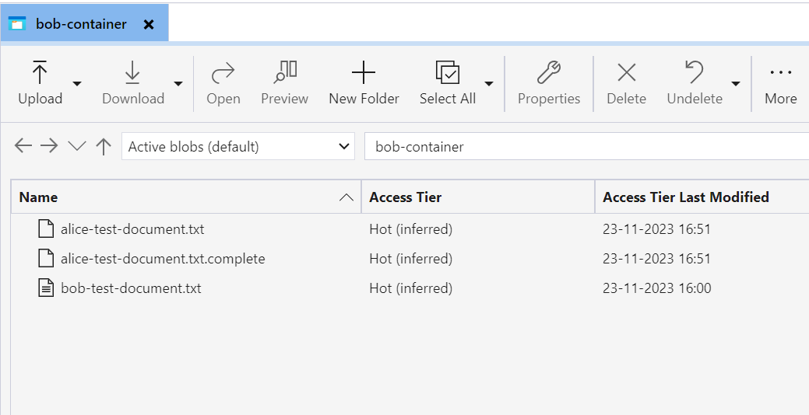

# File Transfer: Azure Blob Storage to Azure Blob Storage

## 1. Description
This tutorial illustrates the process through which a provider participant can transfer a file stored in its Azure Blob Storage to another Azure Blob Storage belonging to a consumer participant.  
For this tutorial, we assume `Alice` as a provider participant and `Bob` as consumer participant.  
We use a self-contained version of Azure Blob Storage named [Azurite](https://learn.microsoft.com/en-us/azure/storage/common/storage-use-azurite?tabs=docker-hub), and we deploy single `Azurite` instance for both connectors, due to `a limitation in overriding endpoints during trasfer process`.

## 2. Existing Resources

Following resources have already been configured.

| Resource                                     | Alice                   | Bob                   | Description                                                                                                                                                                                                                                                                                                                                                                                 |
|----------------------------------------------|-------------------------|-----------------------|---------------------------------------------------------------------------------------------------------------------------------------------------------------------------------------------------------------------------------------------------------------------------------------------------------------------------------------------------------------------------------------------|
| Azure Blob Storage Account Name              | aliceazureaccount       | bobazureaccount       | Configured Azure Blob Storage Account Name                                                                                                                                                                                                                                                                                                                                                  |
| Azure Blob Storage Account Key               | YWxpY2VhenVyZWtleQ==    | Ym9iYXp1cmVrZXk=      | Configured Azure Blob Storage Account key                                                                                                                                                                                                                                                                                                                                                   |
| Azure Blob Storage Account Key Name in Vault | aliceazureaccount-key   | bobazureaccount-key   | The alias under which the Azure Blob Storage Account Key has been stored in the participant's vault. This alias will be used while creating assets. It has been done to avoid leaking secret keys.                                                                                                                                                                                          |
| Azure Blob Storage Account SAS Key in Vault  | aliceazureaccount-sas   | bobazureaccount-sas   | The alias under which a temp Azure Blob Storage Key (Shared Access Signature Key) has been stored in the participant's vault. Participants can share this key to other participants to provide temporary access to their Azure Blob Storage containers, so that other participants could transfer the files. For more details see [Initiate Transfer](#11-initiate-transfer) section below. |
| Azure Blob Storage Container                 | alice-container         | bob-container         | Azure Blob Storage container to store files                                                                                                                                                                                                                                                                                                                                                 |
| Sample File                                  | alice-test-document.txt | bob-test-document.txt | A sample file already uploaded in the container                                                                                                                                                                                                                                                                                                                                             |

## 3. Connect to Azurite
To access azurite locally we need to expose the port outside our kubernetes cluster.
```shell
kubectl port-forward service/azurite 10000:10000
```

## 4. Upload file in Azurite
> You can skip this step entirely if you want to use existing uploaded files.

We can upload files either via [Azure Storage Explorer](https://azure.microsoft.com/en-in/products/storage/storage-explorer) or Azure CLI.

### 4.1 Via Azure Storage Explorer
Connect to Azurite using following details.  
- Account Name: `aliceazureaccount`
- Account Key: `YWxpY2VhenVyZWtleQ==`
- Blobs port: `10000`

Click on the container `alice-container` from the tree hierarchy and upload files using `Upload` button.

### 4.2 using Azure CLI
We can upload file using Azure CLI as well.
```shell
 export ALICE_CONN_STR='AccountName=aliceazureaccount;AccountKey=YWxpY2VhenVyZWtleQ==;DefaultEndpointsProtocol=http;BlobEndpoint=http://127.0.0.1:10000/aliceazureaccount'
 az storage blob upload --container-name alice-container --file /path/to/file --connection-string $ALICE_CONN_STR
```

To create another container, we can run below command.
```shell
az storage container create --name another-alice-container --connection-string $ALICE_CONN_STR
```

## 5. Create Azure Asset

While creating asset, we need to provide the file name, container where it is stored and Azure credential to access the file.
> Please note, an alias (under which the real key is stored in participant's vault) in the field `dataAddress#keyName` has been passed. 
```shell
curl --location 'http://localhost/alice/management/v3/assets' \
--header 'Content-Type: application/json' \
--header 'X-Api-Key: password' \
--data-raw '{
  "@context": {},
  "@id": "10",
  "properties": {
    "name": "alice-test-document",
    "description": "Product EDC Demo Azure Asset",
    "contenttype": "text/plain",
    "version": "1.0"
  },
  "dataAddress": {
    "@type": "DataAddress",
    "type": "AzureStorage",
    "account": "aliceazureaccount",
    "container": "alice-container",
    "blobName": "alice-test-document.txt",
    "keyName": "aliceazureaccount-key"
  }
}'
```

## 6. Create Policy

### 6.1 Create Access Policy
```shell
curl --location 'http://localhost/alice/management/v2/policydefinitions' \
--header 'Content-Type: application/json' \
--header 'X-Api-Key: password' \
--data-raw '{
  "@context": {
    "odrl": "http://www.w3.org/ns/odrl/2/"
  },
  "@type": "PolicyDefinitionRequestDto",
  "@id": "101",
  "policy": {
    "@type": "odrl:Set",
    "odrl:permission": [
      {
        "odrl:action": "USE",
        "odrl:constraint": {
          "@type": "LogicalConstraint",
          "odrl:or": [
            {
              "@type": "Constraint",
              "odrl:leftOperand": "BpnCredential",
              "odrl:operator": {
                "@id": "odrl:eq"
              },
              "odrl:rightOperand": "active"
            }
          ]
        }
      }
    ]
  }
}'
```
### 6.2 Create Contract Policy
```shell
curl --location 'http://localhost/alice/management/v2/policydefinitions' \
--header 'Content-Type: application/json' \
--header 'X-Api-Key: password' \
--data-raw '{
  "@context": {
    "odrl": "http://www.w3.org/ns/odrl/2/"
  },
  "@type": "PolicyDefinitionRequestDto",
  "@id": "102",
  "policy": {
    "@type": "odrl:Set",
    "odrl:permission": [
      {
        "odrl:action": "USE",
        "odrl:constraint": {
          "@type": "LogicalConstraint",
          "odrl:or": [
            {
              "@type": "Constraint",
              "odrl:leftOperand": "BusinessPartnerNumber",
              "odrl:operator": {
                "@id": "odrl:eq"
              },
              "odrl:rightOperand": "BPNL000000000002"
            }
          ]
        }
      }
    ]
  }
}'
```

## 7. Create Contract Definition
```shell
curl --location 'http://localhost/alice/management/v2/contractdefinitions' \
--header 'Content-Type: application/json' \
--header 'X-Api-Key: password' \
--data-raw '{
  "@context": {},
  "@id": "10",
  "@type": "ContractDefinition",
  "accessPolicyId": "101",
  "contractPolicyId": "102",
  "assetsSelector": {
    "@type": "CriterionDto",
    "operandLeft": "https://w3id.org/edc/v0.0.1/ns/id",
    "operator": "=",
    "operandRight": "10"
  }
}'
```

## 8. Query Catalog
Now let's verify whether Bob is able to access the assets or not via querying Alice's catalog.
```shell
curl --location 'http://localhost/bob/management/v2/catalog/request' \
--header 'Content-Type: application/json' \
--header 'X-Api-Key: password' \
--data-raw '{
  "@context": {
    "edc": "https://w3id.org/edc/v0.0.1/ns/"
  },
  "@type": "CatalogRequest",
  "counterPartyAddress": "http://alice-controlplane:8084/api/v1/dsp",
  "counterPartyId": "BPNL000000000001",
  "protocol": "dataspace-protocol-http",
  "querySpec": {
    "offset": 0,
    "limit": 50
  }
}'
```

You should be able to find this asset (`id: 10`) in the list of catalog returned by `Alice`.
```json
{
  "@id": "9c1fc97a-5fcc-49f5-b56a-c78b21ca1f82",
  "@type": "dcat:Catalog",
  "dcat:dataset": [
    {
      "@id": "10",
      "@type": "dcat:Dataset",
      "odrl:hasPolicy": {
        "@id": "MTQ=:MTQ=:MTg4ZDBmN2EtZjhmNC00NjBjLWFkYjUtMDY4OTU5MDMzYjg5",
        "@type": "odrl:Set",
        "odrl:permission": {
          "odrl:target": "10",
          "odrl:action": {
            "odrl:type": "USE"
          },
          "odrl:constraint": {
            "odrl:or": {
              "odrl:leftOperand": "BusinessPartnerNumber",
              "odrl:operator": {
                "@id": "odrl:eq"
              },
              "odrl:rightOperand": "BPNL000000000002"
            }
          }
        },
        "odrl:prohibition": [],
        "odrl:obligation": [],
        "odrl:target": {
          "@id": "10"
        }
      },
      "dcat:distribution": [
        {
          "@type": "dcat:Distribution",
          "dct:format": {
            "@id": "HttpProxy"
          },
          "dcat:accessService": "fb604275-2fc6-4447-9d3e-63707c98a0db"
        },
        {
          "@type": "dcat:Distribution",
          "dct:format": {
            "@id": "AmazonS3"
          },
          "dcat:accessService": "fb604275-2fc6-4447-9d3e-63707c98a0db"
        },
        {
          "@type": "dcat:Distribution",
          "dct:format": {
            "@id": "AzureStorage"
          },
          "dcat:accessService": "fb604275-2fc6-4447-9d3e-63707c98a0db"
        }
      ],
      "version": "1.0",
      "name": "alice-test-document",
      "description": "Product EDC Demo Azure Asset",
      "id": "10",
      "contenttype": "text/plain"
    }
  ],
  "dcat:service": {},
  "participantId": "BPNL000000000001",
  "@context": {}
}
```
> Please take a note of `odrl:hasPolicy#@id` (`MTQ=:MTQ=:MTg4ZDBmN2EtZjhmNC00NjBjLWFkYjUtMDY4OTU5MDMzYjg5`)
field in the response which will be used while initiating negotiation.

## 9. Initiate Negotiation
Please update `offerId` in the below curl request from the above step.
```shell
curl --location 'http://localhost/bob/management/v2/contractnegotiations' \
--header 'Content-Type: application/json' \
--header 'X-Api-Key: password' \
--data-raw '{
  "@context": {
		"@vocab": "https://w3id.org/edc/v0.0.1/ns/"
	},
	"@type": "NegotiationInitiateRequestDto",
	"counterPartyAddress": "http://alice-controlplane:8084/api/v1/dsp",
	"protocol": "dataspace-protocol-http",
	"policy": {
		"@context": "http://www.w3.org/ns/odrl.jsonld",
		"@type": "odrl:Offer",
		"@id": "<Offer ID From Above Step>",
         "assigner": "BPNL000000000001",
		"permission": {
			"odrl:target": "10",
			"odrl:action": {
				"odrl:type": "USE"
			},
			"odrl:constraint": {
				"odrl:or": {
					"odrl:leftOperand": "<TX NAMESPACE>BusinessPartnerGroup",
					"odrl:operator": {
						"@id": "odrl:eq"
					},
					"odrl:rightOperand": "<BUSINESS PARTNER GROUP>"
				}
			}
		},
		"prohibition": [],
		"obligation": [],
		"target": "10"
	}
}'
```

Above API should return below response.
```json
{
  "@type": "IdResponse",
  "@id": "7af8b1ab-84d6-48b5-896c-09dd3a9a2ea1",
  "createdAt": 1700740699131,
  "@context": {
    "@vocab": "https://w3id.org/edc/v0.0.1/ns/",
    "edc": "https://w3id.org/edc/v0.0.1/ns/",
    "tx": "https://w3id.org/tractusx/v0.0.1/ns/",
    "odrl": "http://www.w3.org/ns/odrl/2/"
  }
}
```
> Please take note of the negotiation id (`@id` field) in the response.

## 10. Get Negotiation
Now, we have initiated the negotiation. Let's try to inspect it.
Please update negotiation id in the below curl request.
```shell
curl --location 'http://localhost/bob/management/v2/contractnegotiations/<NEGOTIATION_ID>' \
--header 'X-Api-Key: password'
```
It should return below response.
```json
{
  "@type": "ContractNegotiation",
  "@id": "f1bf0879-7cb5-461b-8c73-ea3957cef6aa",
  "type": "CONSUMER",
  "protocol": "dataspace-protocol-http",
  "state": "FINALIZED",
  "counterPartyId": "BPNL000000000001",
  "counterPartyAddress": "http://alice-controlplane:8084/api/v1/dsp",
  "callbackAddresses": [],
  "createdAt": 1700737605805,
  "contractAgreementId": "5fee8548-2018-4363-b417-95af486c6200",
  "@context": {
		"@vocab": "https://w3id.org/edc/v0.0.1/ns/",
        "edc": "https://w3id.org/edc/v0.0.1/ns/",
        "tx": "https://w3id.org/tractusx/v0.0.1/ns/",
        "tx-auth": "https://w3id.org/tractusx/auth/",
        "cx-policy": "https://w3id.org/catenax/policy/",
        "odrl": "http://www.w3.org/ns/odrl/2/"
	}
}
```
Please note:
- `state` field should be `FINALIZED`. If it is `TERMINATED`, it means negotiation has been failed. Please check logs for more details.
- Take a note of `contractAgreementId` field which will be used while initiating transfer.

## 11. Initiate Transfer
Now, we are about to initiate file transfer. Alice will fetch the file from its container `alice-container` and upload it to provided container which belongs to Bob.

### 11.1 Provide Temporary Access to Destination Azure Container
Since Bob doesn't want to share its Azure credentials to Alice. Hence, he generates a temporary credential and provides it to Alice.
> A temporary token for both Alice and Bob has been already generated and stored in their respective vaults under aliases `aliceazureaccount-sas` and `bobazureaccount-sas`.
> You can skip this step and directly refer those aliases in initiate transfer.

Using Azure CLI, we can generate a shared access signature (`sas`) with limited permissions and expiry.
```shell
export BOB_CONN_STR='AccountName=bobazureaccount;AccountKey=Ym9iYXp1cmVrZXk=;DefaultEndpointsProtocol=http;BlobEndpoint=http://127.0.0.1:10000/bobazureaccount'
az storage container generate-sas --name bob-container --permissions w --expiry '2030-01-01' --connection-string $BOB_CONN_STR
```

Above command generates a sas token with `w` (write) permission inside `bob-container` with an expiry of `2030-01-01`.  
For more details, see [Generating SAS with Azure CLI](https://learn.microsoft.com/en-us/azure/storage/blobs/storage-blob-user-delegation-sas-create-cli)

Now let's store this token inside Bob's vault. Don't forget to replace sas token into below command before executing.
```shell
kubectl exec -it bob-vault-0 -- sh -c "vault kv put secret/bobazureaccount-another-sas content='{\"edctype\": \"dataspaceconnector:azuretoken\",\"sas\": \"<SAS Token without quotes>\"}'"
```

### 11.2 Initiating Transfer Process
Now we are ready to initiate transfer.
```shell
curl --location 'http://localhost/bob/management/v2/transferprocesses' \
--header 'Content-Type: application/json' \
--header 'X-Api-Key: password' \
--data-raw '{
  "@context": {
    "@vocab": "https://w3id.org/edc/v0.0.1/ns/"
  },
  "@type": "https://w3id.org/edc/v0.0.1/ns/TransferRequest",
  "protocol": "dataspace-protocol-http",
  "counterPartyAddress": " http://alice-controlplane:8084/api/v1/dsp",
  "contractId": "<Contract Agreement Id from Get Negotiation Response>",
  "assetId": "10",
  "transferType": "application/octet-stream",
  "dataDestination":  {
        "type": "HttpProxy"
  },
  "privateProperties": {
     "receiverHttpEndpoint": "<Backend Service Endpoint>"
  }
}'
```

This API should return below response.
```json
{
  "@type": "IdResponse",
  "@id": "3c80c7cb-eff1-4538-a05a-6dcfd08f397a",
  "createdAt": 1700740670220,
  "@context": {
    "@vocab": "https://w3id.org/edc/v0.0.1/ns/",
    "edc": "https://w3id.org/edc/v0.0.1/ns/",
    "tx": "https://w3id.org/tractusx/v0.0.1/ns/",
    "odrl": "http://www.w3.org/ns/odrl/2/"
  }
}
```
> Please take note of the transfer process id (`@id` field) in the response.

## 12. Get Transfer
Just wait for few seconds and check the transfer state.
Please replace transfer process id before running command.
```shell
curl --location 'http://localhost/bob/management/v2/transferprocesses/<TRANSFER_PROCESS_ID>' \
--header 'X-Api-Key: password'
```

It should return below response:
```json
{
  "@id": "6e81fb62-a6e1-401f-9748-cd5cbf5fa0c5",
  "@type": "TransferProcess",
  "correlationId": "6e81fb62-a6e1-401f-9748-cd5cbf5fa0c5",
  "state": "COMPLETED",
  "stateTimestamp": 1700738463944,
  "type": "CONSUMER",
  "assetId": "14",
  "contractId": "5fee8548-2018-4363-b417-95af486c6200",
  "callbackAddresses": [],
  "dataDestination": {
    "@type": "DataAddress",
    "container": "bob-container",
    "type": "AzureStorage",
    "account": "bobazureaccount",
    "keyName": "bobazureaccount-sas"
  },
  "connectorId": "BPNL000000000001",
  "@context": {}
}
```
> Please note, `state` should be `COMPLETED`. If it is `TERMINATED`, it means, transfer has been failed. Please check logs for more details.

## 13. Validate Transfer
Now we can validate whether file has been transferred in `bob-container` or not.  
Once transfer is complete, it should look like this.


We can also list files in container using Azure CLI.
```shell
az storage blob list --container-name bob-container -o table --connection-string $BOB_CONN_STR
```
