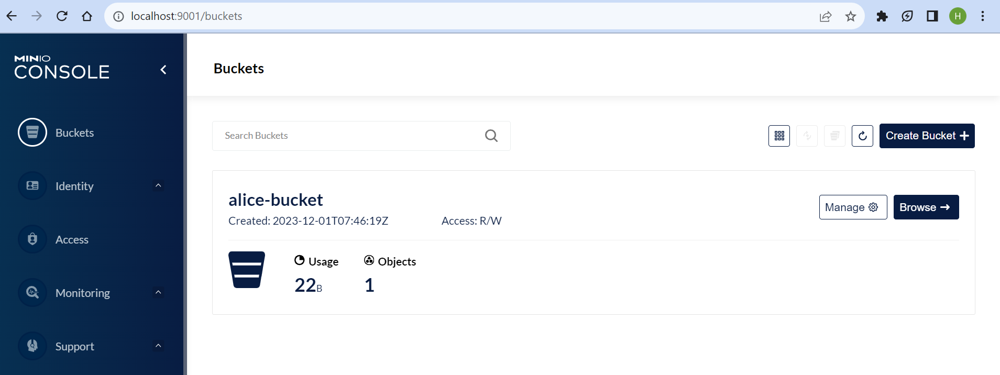
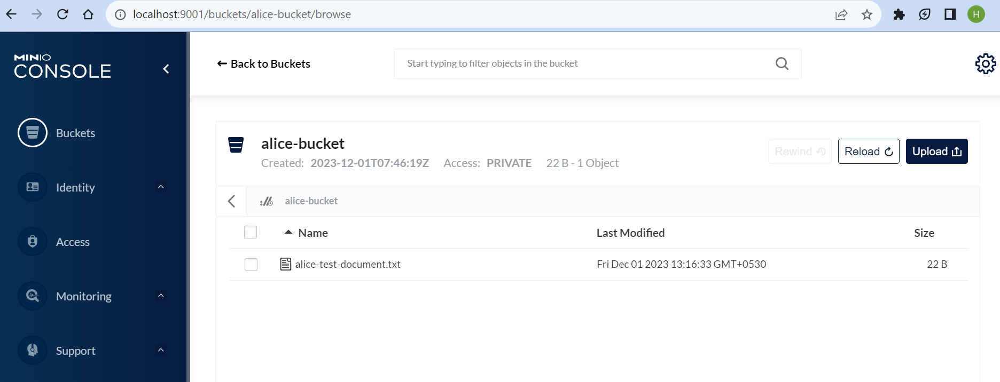
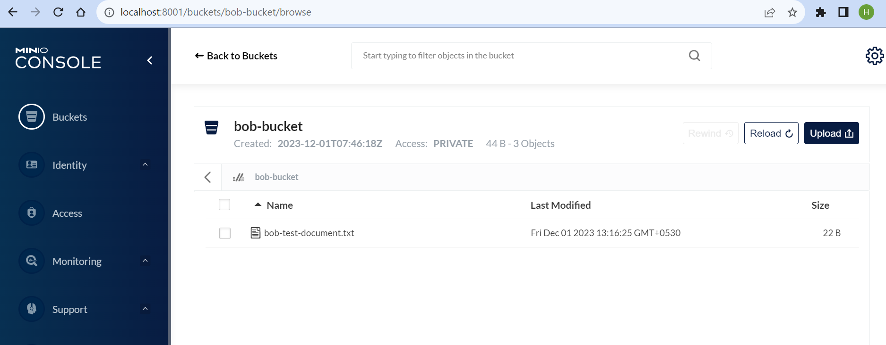
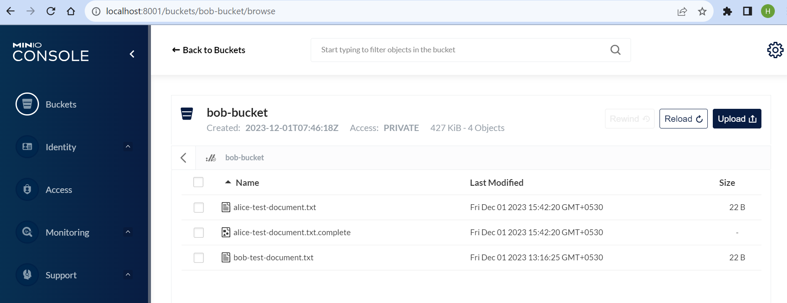

# File Transfer: Amazon S3 to Amazon S3

## 1. Description
This tutorial illustrates the process through which a provider participant can transfer a file stored in its Amazon S3 to another Amazon S3 belonging to a consumer participant.  
For this tutorial, we assume `Alice` as a provider participant and `Bob` as consumer participant.  
We use a self-contained version of Amazon S3 named [MinIO](https://github.com/minio/minio), and we deploy two instances, one each for `Alice` and `Bob`.

## 2. Existing Resources

Following resources have already been configured.

| Resource              | Alice                   | Bob                   | Description                                    |
|-----------------------|-------------------------|-----------------------|------------------------------------------------|
| AWS Access Key Id     | aliceawsclient          | bobawsclient          | Configured AWS access id in MinIO              |
| AWS Secret Access Key | aliceawssecret          | bobawssecret          | Configured AWS secret access key in MinIO      |
| S3 Bucket Name        | alice-bucket            | bob-bucket            | An S3 bucket created for demonstration purpose |
| Sample File           | alice-test-document.txt | bob-test-document.txt | A sample file already uploaded in the bucket   |

## 3. Connect to MinIO
To access MinIO locally we need to expose the port outside our kubernetes cluster.  
MinIO contains a web interface called MinIO Console, so we will expose its port as well.

### 3.1 Connect to Alice's MinIO
```shell
kubectl port-forward service/alice-minio 9000:9000 9001:9001
```
Now, navigate to http://localhost:9001 and login with Alice's access key id and secret access key. You should be able to see MinIO Console.


If you click on `Browse`, you can see the files stored in `alice-bucket`.


### 3.2 Connect to Bob's MinIO
Similarly, you can access Bob's MinIO as well. Open a new terminal and run below command.
```shell
kubectl port-forward service/bob-minio 8000:9000 8001:9001
```
Now, navigate to http://localhost:8001 and login with Bob's access key id and secret access key.


## 4. Upload file in Alice's MinIO
> You can skip this step entirely if you want to use existing uploaded files.

We can upload files either via MinIO Console or AWS CLI.

### 4.1 Via MinIO Console
- Open Alice's MinIO Console via following steps mentioned in [previous step](#31-connect-to-alices-minio).
- `Browse` content of the bucket `alice-bucket`.
- Click on `Upload` button and select any sample file to upload. 

### 4.2 Via AWS CLI
Let's configure [AWS CLI](https://docs.aws.amazon.com/cli/latest/userguide/getting-started-install.html) with Alice's credentials.
```shell
 aws configure
```
When prompted, enter Alice's access key id / secret.  

Now, you can upload file using below command.
```shell
aws s3 cp assets/test-document.txt s3://alice-bucket/another-test-document.txt --endpoint-url http://localhost:9000
```

## 5. Create S3 Asset

While creating asset, we need to provide file name, S3 bucket name and AWS region where it is stored.
```shell
curl --location 'http://localhost/alice/management/v3/assets' \
--header 'Content-Type: application/json' \
--header 'X-Api-Key: password' \
--data-raw '{
  "@context": {},
  "@id": "20",
  "properties": {
    "name": "alice-test-document",
    "description": "Product EDC Demo S3 Asset",
    "contenttype": "text/plain",
    "version": "1.0"
  },
  "dataAddress": {
    "@type": "DataAddress",
    "type": "AmazonS3",
    "keyName": "alice-test-document.txt",
    "region": "us-east-1",
    "bucketName": "alice-bucket"
  }
}'
```

## 6. Create Policy

### 6.1 Create Access Policy
```shell
curl --location 'http://localhost/alice/management/v2/policydefinitions' \
--header 'Content-Type: application/json' \
--header 'X-Api-Key: password' \
--data-raw '{
  "@context": {
    "odrl": "http://www.w3.org/ns/odrl/2/"
  },
  "@type": "PolicyDefinitionRequestDto",
  "@id": "201",
  "policy": {
    "@type": "odrl:Set",
    "odrl:permission": [
      {
        "odrl:action": "USE",
        "odrl:constraint": {
          "@type": "LogicalConstraint",
          "odrl:or": [
            {
              "@type": "Constraint",
              "odrl:leftOperand": "BpnCredential",
              "odrl:operator": {
                "@id": "odrl:eq"
              },
              "odrl:rightOperand": "active"
            }
          ]
        }
      }
    ]
  }
}'
```
### 6.2 Create Contract Policy
```shell
curl --location 'http://localhost/alice/management/v2/policydefinitions' \
--header 'Content-Type: application/json' \
--header 'X-Api-Key: password' \
--data-raw '{
  "@context": {
    "odrl": "http://www.w3.org/ns/odrl/2/"
  },
  "@type": "PolicyDefinitionRequestDto",
  "@id": "202",
  "policy": {
    "@type": "odrl:Set",
    "odrl:permission": [
      {
        "odrl:action": "USE",
        "odrl:constraint": {
          "@type": "LogicalConstraint",
          "odrl:or": [
            {
              "@type": "Constraint",
              "odrl:leftOperand": "BusinessPartnerNumber",
              "odrl:operator": {
                "@id": "odrl:eq"
              },
              "odrl:rightOperand": "BPNL000000000002"
            }
          ]
        }
      }
    ]
  }
}'
```

## 7. Create Contract Definition
```shell
curl --location 'http://localhost/alice/management/v2/contractdefinitions' \
--header 'Content-Type: application/json' \
--header 'X-Api-Key: password' \
--data-raw '{
  "@context": {},
  "@id": "20",
  "@type": "ContractDefinition",
  "accessPolicyId": "201",
  "contractPolicyId": "202",
  "assetsSelector": {
    "@type": "CriterionDto",
    "operandLeft": "https://w3id.org/edc/v0.0.1/ns/id",
    "operator": "=",
    "operandRight": "20"
  }
}'
```

## 8. Query Catalog
Now let's verify whether Bob is able to access the assets or not via querying Alice's catalog.
```shell
curl --location 'http://localhost/bob/management/v2/catalog/request' \
--header 'Content-Type: application/json' \
--header 'X-Api-Key: password' \
--data-raw '{
  "@context": {
    "edc": "https://w3id.org/edc/v0.0.1/ns/"
  },
  "@type": "CatalogRequest",
  "counterPartyAddress": "http://alice-controlplane:8084/api/v1/dsp",
  "counterPartyId": "BPNL000000000001",
  "protocol": "dataspace-protocol-http",
  "querySpec": {
    "offset": 0,
    "limit": 50
  }
}'
```

You should be able to find this asset (`id: 20`) in the list of catalog returned by `Alice`.
```json
{
  "@id": "9c1fc97a-5fcc-49f5-b56a-c78b21ca1f82",
  "@type": "dcat:Catalog",
  "dcat:dataset": [
    {
      "@id": "20",
      "@type": "dcat:Dataset",
      "odrl:hasPolicy": {
        "@id": "MjA=:MjA=:YWNjNGRkZjctMjZiYS00ZDlmLTkzNDEtNDUyZmViYTlmZjE3",
        "@type": "odrl:Set",
        "odrl:permission": {
          "odrl:target": "20",
          "odrl:action": {
            "odrl:type": "USE"
          },
          "odrl:constraint": {
            "odrl:or": {
              "odrl:leftOperand": "BusinessPartnerNumber",
              "odrl:operator": {
                "@id": "odrl:eq"
              },
              "odrl:rightOperand": "BPNL000000000002"
            }
          }
        },
        "odrl:prohibition": [],
        "odrl:obligation": [],
        "odrl:target": {
          "@id": "20"
        }
      },
      "dcat:distribution": [
        {
          "@type": "dcat:Distribution",
          "dct:format": {
            "@id": "HttpProxy"
          },
          "dcat:accessService": "07d469e1-f1be-459b-a69d-ed16fd1fec3e"
        },
        {
          "@type": "dcat:Distribution",
          "dct:format": {
            "@id": "AmazonS3"
          },
          "dcat:accessService": "07d469e1-f1be-459b-a69d-ed16fd1fec3e"
        }
      ],
      "version": "1.0",
      "name": "alice-test-document",
      "description": "Product EDC Demo S3 Asset",
      "id": "20",
      "contenttype": "text/plain"
    }
  ],
  "dcat:service": {},
  "participantId": "BPNL000000000001",
  "@context": {}
}
```
> Please take a note of `odrl:hasPolicy#@id` (`MjA=:MjA=:YWNjNGRkZjctMjZiYS00ZDlmLTkzNDEtNDUyZmViYTlmZjE3`)
field in the response which will be used while initiating negotiation.

## 9. Initiate Negotiation
Please update `offerId` in the below curl request from the above step.
```shell
curl --location 'http://localhost/bob/management/v2/contractnegotiations' \
--header 'Content-Type: application/json' \
--header 'X-Api-Key: password' \
--data-raw '{
	"@context": {
		"@vocab": "https://w3id.org/edc/v0.0.1/ns/"
	},
	"@type": "NegotiationInitiateRequestDto",
	"counterPartyAddress": "http://alice-controlplane:8084/api/v1/dsp",
	"protocol": "dataspace-protocol-http",
	"policy": {
		"@context": "http://www.w3.org/ns/odrl.jsonld",
		"@type": "odrl:Offer",
		"@id": "<Offer Id>",
         "assigner": "BPNL000000000001",
		"permission": {
			"odrl:target": "<Asset Id>",
			"odrl:action": {
				"odrl:type": "USE"
			},
			"odrl:constraint": {
				"odrl:or": {
					"odrl:leftOperand": "{{TX_NAMESPACE}}BusinessPartnerGroup",
					"odrl:operator": {
						"@id": "odrl:eq"
					},
					"odrl:rightOperand": "<Business Partner Group>}}"
				}
			}
		},
		"prohibition": [],
		"obligation": [],
		"target": "<Asset Id>"
	}
}'
```

Above API should return below response.
```json
{
  "@type": "IdResponse",
  "@id": "53668c69-106d-416c-8118-af23d171b938",
  "createdAt": 1701425299412,
  "@context": {
    "@vocab": "https://w3id.org/edc/v0.0.1/ns/",
    "edc": "https://w3id.org/edc/v0.0.1/ns/",
    "tx": "https://w3id.org/tractusx/v0.0.1/ns/",
    "odrl": "http://www.w3.org/ns/odrl/2/"
  }
}
```
> Please take note of the negotiation id (`@id` field) in the response.

## 10. Get Negotiation
Now, we have initiated the negotiation. Let's try to inspect it.  
Please update negotiation id in the below curl request.
```shell
curl --location 'http://localhost/bob/management/v2/contractnegotiations/<NEGOTIATION_ID>' \
--header 'X-Api-Key: password'
```
It should return below response.
```json
{
  "@type": "ContractNegotiation",
  "@id": "53668c69-106d-416c-8118-af23d171b938",
  "type": "CONSUMER",
  "protocol": "dataspace-protocol-http",
  "state": "FINALIZED",
  "counterPartyId": "BPNL000000000001",
  "counterPartyAddress": "http://alice-controlplane:8084/api/v1/dsp",
  "callbackAddresses": [],
  "createdAt": 1701425299412,
  "contractAgreementId": "48bad8fd-e24d-40e9-91d3-6d7f82693989",
  "@context": {}
}
```
Please note:
- `state` field should be `FINALIZED`. If it is `TERMINATED`, it means negotiation has been failed. Please check logs for more details.
- Take a note of `contractAgreementId` field which will be used while initiating transfer.

## 11. Initiate Transfer
Please update contract agreement id from above step in the below curl request.
```shell
curl --location 'http://localhost/bob/management/v2/transferprocesses' \
--header 'Content-Type: application/json' \
--header 'X-Api-Key: password' \
--data-raw '{
  "@context": {
    "odrl": "http://www.w3.org/ns/odrl/2/"
  },
  "assetId": "20",
  "connectorAddress": "http://alice-controlplane:8084/api/v1/dsp",
  "connectorId": "BPNL000000000001",
  "contractId": "<Contract Agreement Id from Get Negotiation Response>",
  "dataDestination": {
    "type": "AmazonS3",
    "keyName": "alice-test-document.txt",
    "bucketName": "bob-bucket",
    "region": "us-east-1",
    "endpointOverride": "http://bob-minio:9000",
    "accessKeyId": "bobawsclient",
    "secretAccessKey": "bobawssecret"
  },
  "protocol": "dataspace-protocol-http"
}'
```

This API should return below response.
```json
{
  "@type": "IdResponse",
  "@id": "40fdb511-68f2-453f-bd9b-8e5e728508aa",
  "createdAt": 1701425537697,
  "@context": {
    "@vocab": "https://w3id.org/edc/v0.0.1/ns/",
    "edc": "https://w3id.org/edc/v0.0.1/ns/",
    "tx": "https://w3id.org/tractusx/v0.0.1/ns/",
    "odrl": "http://www.w3.org/ns/odrl/2/"
  }
}
```
> Please take note of the transfer process id (`@id` field) in the response.

## 12. Get Transfer
Just wait for few seconds and check the transfer state.  
Please replace transfer process id before running command.
```shell
curl --location 'http://localhost/bob/management/v2/transferprocesses/<TRANSFER_PROCESS_ID>' \
--header 'X-Api-Key: password'
```

It should return below response:
```json
{
  "@id": "40fdb511-68f2-453f-bd9b-8e5e728508aa",
  "@type": "TransferProcess",
  "correlationId": "40fdb511-68f2-453f-bd9b-8e5e728508aa",
  "state": "COMPLETED",
  "stateTimestamp": 1701425542142,
  "type": "CONSUMER",
  "assetId": "20",
  "contractId": "48bad8fd-e24d-40e9-91d3-6d7f82693989",
  "callbackAddresses": [],
  "dataDestination": {
    "@type": "DataAddress",
    "secretAccessKey": "bobawssecret",
    "accessKeyId": "bobawsclient",
    "endpointOverride": "http://bob-minio:9000",
    "region": "us-east-1",
    "type": "AmazonS3",
    "keyName": "alice-test-document.txt",
    "bucketName": "bob-bucket"
  },
  "connectorId": "BPNL000000000001",
  "@context": {}
}
```
> Please note, `state` should be `COMPLETED`. If it is `TERMINATED`, it means, transfer has been failed. Please check logs for more details.

## 13. Validate Transfer
Now we can validate that file has been transferred to `bob-bucket`.  
Once transfer is complete, `alice-test-document.txt` should be present in `bob-bucket`.

Open Bob's MinIO Console and browse files in `bob-bucket`. It should look like this.


We can also list files in bucket via AWS CLI.

First, let's configure AWS CLI to use Bob's credentials.
```shell
aws configure
```
When prompted, enter Bob's access key id / secret.

```shell
aws s3 ls s3://bob-bucket --endpoint-url http://localhost:8000
```
You should see list of files in `bob-bucket`.
```text
2023-12-01 15:42:20         22 alice-test-document.txt
2023-12-01 15:42:20          0 alice-test-document.txt.complete
2023-12-01 13:16:25         22 bob-test-document.txt
```
