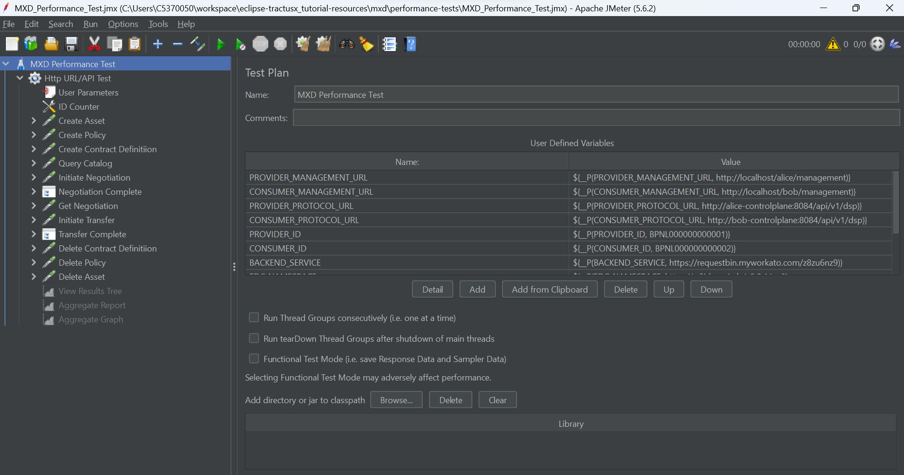

# Tractus-X EDC Performance Test

## 1. Prerequisites
- Download and Install  [Apache JMeter](https://jmeter.apache.org/download_jmeter.cgi).
- Add JMETER_HOME/bin to the environment path. [Optional]
- Deploy Tractusx EDC connectors. If you don't have, you can deploy MXD.

## 2. How to run
- Update connectors properties in the file [connector.properties](connector.properties).
- Run Following command.
```shell
jmeter -n -t MXD_Performance_Test.jmx -l report.jtl -q connector.properties -e -o report
```

> It will create a raw `report.jtl` file which will have all the results. It will also generate a nice html report in `report` directory at the end of the performance test.

## 3. Update the JMeter Script
- Open the script:
```shell
jmeter -t MXD_Performance_Test.jmx
```
- JMeter window will open like this.

- Update the components as per your requirements and save it.

## Resources
- [JMeter Getting Started](https://jmeter.apache.org/usermanual/get-started.html)
- [JMeter Component Reference](https://jmeter.apache.org/usermanual/component_reference.html)
- [JMeter Functions Reference](https://jmeter.apache.org/usermanual/functions.html)
- [JMeter Generating Report](https://jmeter.apache.org/usermanual/generating-dashboard.html)
