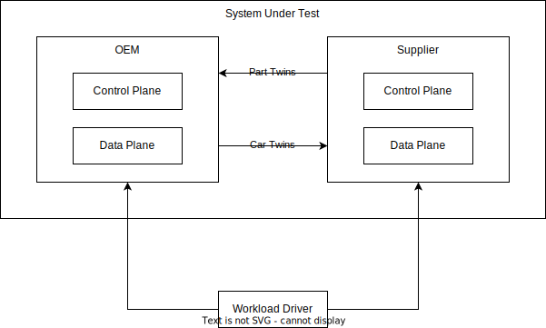
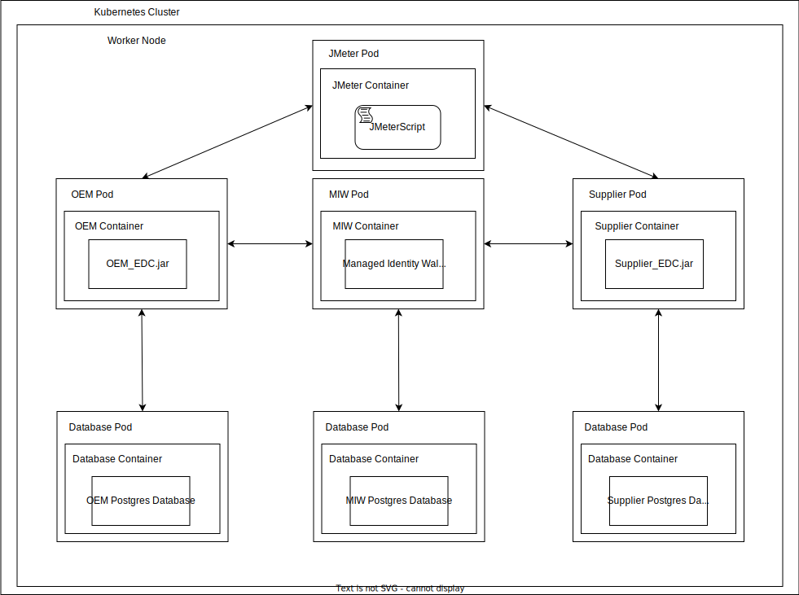

# EDC Performance Tests

## Table of Contents
- [Introduction](#introduction)
- [Goals of the Test](#goals-of-the-test)
- [Tools](#tools)
- [Test Design](#test-design)
- [User Guide](#user-guide)

## Introduction
This document describes the design of the Eclipse Dataspace Connector (EDC) Performance Tests.
The EDC is the central communication component in Catena-X, which as a connector implements a framework agreement for sovereign, cross-organizational data exchange.

## Goals of the test
The test measures performance in scenarios similar to those found in the
automotive industry. It uses a parameter-based, customizable framework
adaptable to real business situations. It aims to cover a wide range of use
cases and evaluate their performance.

To ensure the credibility of the test, the test is based on defined characteristics:

- Real-world: The performance workload should have the characteristics of real-world systems.
- Complexity: The test should capture intra- and inter-company business processes from two counter parties.
- Openness and version independence: The test should be able to be implemented using different versions of the EDC and not be limited to a specific use case scenario.

## Tools
The test and its framework are based on the Java-based test tool [Apache Jmeter](https://jmeter.apache.org/usermanual/generating-dashboard.html). The test scripts are implemented exclusively as .jmx files, an XML-coded script that uses JMeter as the default file format for testing.

In the first stage of these performance tests, the EDC is simulated using Minimum Tractus-X Dataspace ([MXD](https://eclipse-tractusx.github.io/docs-kits/kits/Connector%20Kit/Adoption%20View/connector_kit_adoption_view)).

## Test Design

### Definition of General Terms
| Term                         | Explanation|
|------------------------------|------------------------------|
| OEM                          | An OEM or "Original Equipment Manufacturer" manufactures a part or component that is used in another company's product   |
| Supplier                     | An Supplier represents the end of the supply chain in the test scenario and manufactures the end product   |

### Test Setup
The relationship between the test setup and the setup of the Minimum Tractus-X Dataspace is visualized in the following figure. It should be emphasized that both the OEM and the supplier act as data recipients and senders.



### Deployment of the Test
In order to create a test environment that is as realistic as possible, a deployment in a Kubernetes cluster is used for the test, which in turn deploys a worker node. This worker node of the cluster is characterized by the deployment of two EDCs, each for OEM and supplier and the respective connectors. The contents of the two EDCs are stored in a Postgres database.
The actual test and thus the workload for the EDCs is carried out by a JMeter script. The entire context is visualized below.



### Functional structure of the test
The experiment is divided into three different phases. Each phase is implemented as own .jmx file.

#### Setup
During the setup phase an initial set of asset, policy and contract data are loaded into the connectors. The purpose of these data sets is introduce a certain level of data aging before conducting measurements.

#### Measurement Interval
This phase represents the actual performance evaluation. The script runs through all standard processes that can be executed by the EDC. The process starts with the creation of assets, policies and contract definitions based on the number of mock-up data from the previous process. This is followed by further EDC processes such as "Create Catalogue" until the data transfer is negotiated and executed, as described in the
[EDC wiki](#https://eclipse-tractusx.github.io/docs-kits/category/connector-kit/).
In order to test this section as realistically as possible, the process is carried out for both OEMs ("OEM Plants") and suppliers ("Supplier Plants"). The section also contains the "Supplier Fleet Manager" process, a process designed to simulate employees at the supplier who request digital twins of the cars.

### Definition of Properties (experiment.properties)

#### General Parameters

| Property                        | Explanation|
|------------------------------|------------------------------|
| EXPERIMENT_DURATION_SEC                   | Duration of the experiment, during which the threads of the experiment are executed as often as possible. The unit is defined in seconds.  |
| EDC_NAMESPACE                    | URL as an Permanent identifier of the EDC and its version.   |
| BACKEND_SERVICE                     |  URL to reference the backend system of the EDCs.  | 
| MAX_NEGOTIATION_POLL_COUNT                     | Number of maximum status checks of "FINALIZED" state of the negotiation between the two initiated EDCs Alice and Bob. |
| MAX_TRANSFER_POLL_COUNT                     | Number of maximum status checks of "FINALIZED" state of the transfer between the two initiated EDCs Alice and Bob. |
| INTERVALS_PER_MINUTE                     | Number of simulated time intervals per minute.  |

#### OEM Parameters

| Property                        | Explanation|
|------------------------------|------------------------------|
| OEM_ID                  | Unique identifier of the OEM (Business Partner Number).  |
| OEM_MANAGEMENT_URL                    | URL referencing the Management API of the OEM's EDC.   |
| OEM_PROTOCOL_URL                     | URL referencing the Dataspace Protocol of the OEM Connector.   |
| OEM_API_KEY                     | Specific, secret key to access the Management API of the OEM's EDC.  |
| OEM_PLANTS                     | Number of OEM plants manufacturing cars. Each plant is modeled as individual thread.  |
| OEM_CARS_INITIAL                     |  Number of inital produced cars in the "SetUp" process for creating mockup data in the database for further processes |
| PARTS_PER_CAR                     | Number of part twins requested by the OEM from the supplier during the production of a car.   |
| CARS_PRODUCED_PER_INTERVALL                     | Number of cars produced by the OEM during a time interval per plant.   |
| ADDITIONAL_CONTRACT_DEFINITIONS_OEM                     | Number of additional contract definitions added at the setup stage.   |

#### Supplier Parameters

| Property                        | Explanation                                                                                                           |
|------------------------------|-----------------------------------------------------------------------------------------------------------------------|
| SUPPLIER_ID                 | Unique identifier of the Supplier (Business Partner Number)                                                           |
| SUPPLIER_MANAGEMENT_URL                    | URL referencing the Management API of the Supplier EDC.                                                               |
| SUPPLIER_PROTOCOL_URL                     | URL referencing the Dataspace Protocol of the Supplier Connector.                                                     |
| SUPPLIER_API_KEY                     | Specific, secret key to access the Management API of the Supplier EDC.                                                |
| SUPPLIER_PLANTS                     | Number of supplier plants manufacturing parts. Each plant is modeled as individual thread.                            |
| PARTS_PRODUCED_PER_INTERVALL                     | Number of cars produced by the OEM during a time interval per plant.                                                  |
| SUPPLIER_FLEET_MANAGERS                     | Number of employees requesting car twins.                                                                             |
| CARS_REQUESTED_PER_INTERVALL                     | Number of car twins requested by the supplier per time interval per employee.                                         |
| SUPPLIER_PARTS_INITIAL                    | Number of inital produced parts in the "SetUp" process for creating mockup data in the database for further processes |
| ADDITIONAL_CONTRACT_DEFINITIONS_SUPPLIER                    | Number of additional contract definitions added at the setup stage.                                                   |

### Functional structure in dependency to the parameter

#### Visualization
The number of times the processes, which depicts the execution of the production of the cars, the parts required for them and the invoices created for them, are executed in the test setup depends on the three parameters "OEM_PLANTS", "SUPPLIER_PLANTS" and "SUPPLIER FLEET MANAGER". This relationship is illustrated in the following figure:


The sub-process of executing the above processes is characterized by the number of cars tested. The parameter "OEM_CARS_INITIAL" can be used to define the number of mock-up cars to be created in the setup.jmx. This parameter is then passed to the measurement_interval.jmx and defines the start of the number of cars produced there (starting with counter amount 1).


## User Guide

### Installation of Required Softwares

#### Setup MXD
The minimum Tractus-X Dataspace is required to carry out the tests in a local environment.
The software and tools required for this are described in the [Eclipse MXD Wiki](https://github.com/eclipse-tractusx/tutorial-resources/blob/main/mxd/README.md#1-prerequisites).

The setup of the dataspace is explained further in [MXD Setup Wiki](https://github.com/eclipse-tractusx/tutorial-resources/blob/main/mxd/README.md#2-basic-dataspace-setup).

#### Install JMeter
- To run the Jmeter tool, a Java Runtime Environment (JRE) is required, which can be installed [here](https://www.java.com/de/download/manual.jsp).
- After installing the Tractus-X Dataspace, the test software must now be installed.
  To do this, the Jmeter tool must first be installed. Download [here](https://jmeter.apache.org/download_jmeter.cgi).
- Add the JMETER_HOME environment variable and let it reference the /bin directory of JMeter.

### Setup Cluster
1. Install kind and run ```kind```

#### Local run
Install kind and run ```kind create cluster -n mxd```, this will create a local cluster named ```kind-mxd```
which is the default cluster name.

#### Remote run
For remote run you don't need ```kind``` just provide the name of the remote cluster in -x and -y args.

#### Remote run in two separate clusters
Collect .kube/config files and merge them in one as described [here](https://blog.thenets.org/managing-multiples-kubernetes-clusters-with-kubectl/).
Then provide the name of the remote cluster for test pod with -x arg, and name of the remote cluster for rest of pods using -y arg.

### Running the Evaluation
Once all tools and software have been installed and the Tractus-X Dataspace has been deployed as explained in the wiki, the test can be executed:

The script ```./experiment_controller.sh```
1. Deploys terraform from ```mxd```folder to a provided cluster
2. Starts the ```mxd-performance-test``` container which runs
   ```small_experiment.properties``` by default with latest changes from .jmx files.

#### Display help
```./experiment_controller.sh -h```
For more information about arguments visit [help.txt](help.txt).

#### Run default experiment file small_experiment.properties on ```kind-mxd``` cluster
```./experiment_controller.sh```

#### Run all files from test-configurations folder on ```kind-mxd``` cluster
```./experiment_controller.sh -f test-configurations```

#### Run just one file ex:  medium_experiment_10_contracts.properties  on ```kind-mxd``` cluster
```./experiment_controller.sh -f test-configurations/medium_experiment_10_contracts.properties```

#### Run default experiment file small_experiment.properties on ```shoot--edc-lpt--mxd``` cluster
```./experiment_controller.sh -x shoot--edc-lpt--mxd -y shoot--edc-lpt--mxd```

####  Run default experiment file with test container on ```kind-mxd``` cluster and the rest of the environment on ```shoot--edc-lpt--mxd``` cluster
```./experiment_controller.sh -x kind-mxd -y shoot--edc-lpt--mxd```

#### Run all files from test-configurations folder on separate clusters
```./experiment_controller.sh -f test-configurations -x kind-mxd -y shoot--edc-lpt--mxd```

Enjoy the test results!

### Test results
After executing the shell script, the test results can be viewed at /Output/measurement_interval/index.html.
Of relevance is the sub-item "Statistics" in index.html. This sub-item contains, among other things:

| Naming                        | Explanation               |
|------------------------------|------------------------------|
| Executions     | Number of processes performed  |
| Response Time (ms)   | Number in milliseconds of how long it takes the EDC to respond  |
| Throughput    | Ratio of executions to response time  |
| Network (KB/sec)    | Data throughput of the EDC in KB   |

[See JMeter Dashboard Reference](https://jmeter.apache.org/usermanual/generating-dashboard.html)

### Customizing the Experiments

1. [OPTIONAL] Review and update the connectors properties in the three different .properties files.

| Naming                       | Default Values               |
|------------------------------|------------------------------|
| small_experiment.properties  | Supplier/OEM Plants = 1, Initial cars/parts = 10000  |
| medium_experiment.properties | Supplier/OEM Plants = 5, Initial cars/parts = 100000  |
| medium_experiment.properties | Supplier/OEM Plants = 10, Initial cars/parts = 1000000  |
